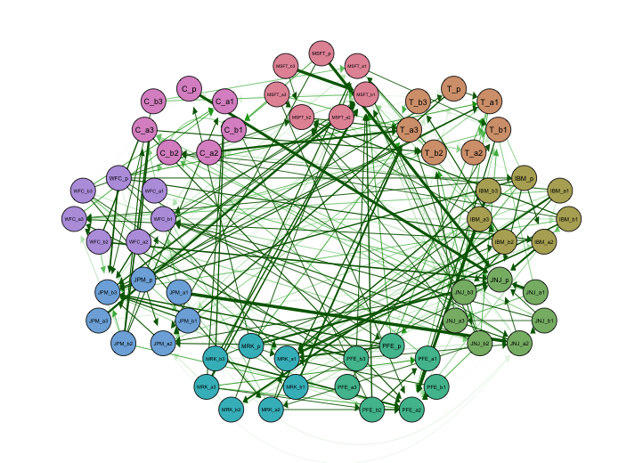

[](http://quantlet.de/)

## [](http://quantlet.de/) **hfhd_cirnet** [](http://quantlet.de/)

```yaml


Name of Quantlet: hfhd_cirnet

Published in: 	  Bootstrapped Market Impact with Limit Order Books

Description:      'hfhd_cirnet code plots the full-sample connectedness network.'


Keywords:         limit order book, market impact, network, plot

Author:           Shi Chen

Submitted:        2017/09/11

Output:           'The network graph of full-sample connectedness for the selected 			   trading day.'

```





### R Code
```r

rm(list=ls(all=T))
graphics.off()
library(qgraph)
setwd("")

coname= c("MSFT","T","IBM", "JNJ","PFE","MRK","JPM","WFC","C")
lobname = c("p", "a1","b1","a2","b2","a3","b3")
na1 =rep(lobname, 9)
na2 = rep(coname, each=7)
myname = paste(na2, na1,sep="_")
rm(coname, lobname, na1, na2)

load("mydate.RData")
#load("fullconnectedness1n.RData")
load("fullconnectedness5.RData")

d1=1#15-20,21.06-28.06
samp1 = conn1[[d1]]
diag(samp1)=0
rownames(samp1)=colnames(samp1)=myname
mygroup=list(1:7,8:14,15:21,22:28,29:35,36:42,43:49,50:56,57:63)
names(mygroup)=c("MSFT","T","IBM", "JNJ","PFE","MRK","JPM","WFC","C")

#mygroup=list(43:49,50:56,57:63)
#names(mygroup)=c("JPM","WFC","C")
par(mfrow=c(1,1))
#qgraph(samp1, palette="pastel", layout="spring", legend =F, minimum=0.12, arrow =T, groups=mygroup, line=2.5)
qgraph(samp1, palette="pastel", layout="circular", legend =F, minimum=0.05, arrow =T, groups=mygroup, line=2.5)
mtext(mydate[d1], side = 3, line = -1.25, outer = TRUE, font=2)

```

automatically created on 2018-05-28